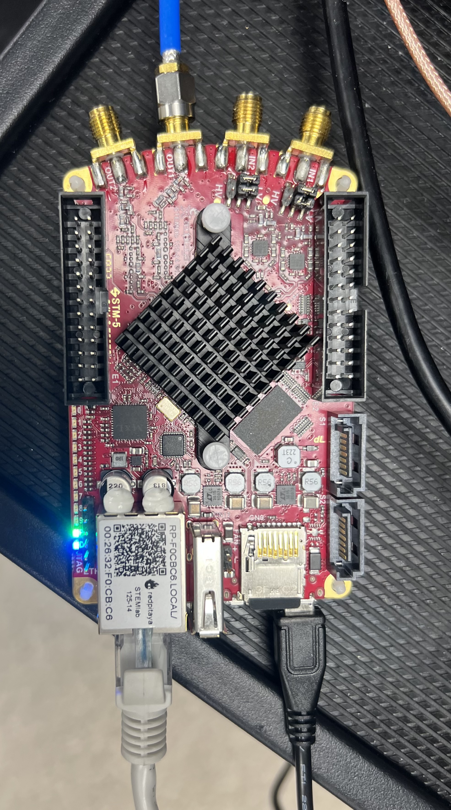

# Instructions for Using the Waveform Generation Script

## Quick Start Guide

### Physical Setup of Red Pitaya
Before running the script, ensure the following physical connections are made:
- **SD Card:** Must be inserted into the Red Pitaya.
- **Ethernet Cable:** Must be plugged in to provide network access.
- **Power Supply:** Must be connected and turned on.
- **SMA Cable:** The output signal should be connected to **OUT1**.

**Images of the setup:**



## Configuring Inputs
Before running the script, modify the input parameters at the top of the script:


```python
# Input parameters for the waveform
v_start = 0  # Start voltage in volts (V)
v_end = 1  # End voltage in volts (V)
v_down_end = 1 * v_end  # Voltage at the end of the downward slope

# Input voltage duration in milliseconds
start_v_ms = 20  # Duration at the start voltage
slope_up_ms = 6  # Duration of the upward slope
slope_down_ms = 0  # Duration of the downward slope
end_v_ms = 500  # Duration at the end voltage
```

## Requirements
- **Python 3.x** installed on your system
- Required Python libraries:
  - `matplotlib`
  - `numpy`
  - `redpitaya_scpi`
  ```bash
   pip install matplotlib numpy redpitaya_scpi
   ```
- A Red Pitaya device connected to the network
- A valid Red Pitaya hostname or IP address

## Setup

### Starting Red Pitaya SCPI Server at Boot
To ensure the SCPI server starts automatically at boot, follow these steps:
1. Connect to your Red Pitaya via SSH.
2. Stop the Nginx service to prevent conflicts:
   ```bash
   systemctl stop redpitaya_nginx
   ```
3. Start the SCPI server manually:
   ```bash
   systemctl start redpitaya_scpi &
   ```
4. To enable SCPI at boot and disable Nginx, run:
   ```bash
   systemctl disable redpitaya_nginx
   systemctl enable redpitaya_scpi
   ```


1. **Install Dependencies**
   If you haven't installed the required Python libraries, run the following command:


2. **Connect to Red Pitaya**
   Ensure that your Red Pitaya device is powered on and connected to the same network as your computer. Update the `rp_ip` variable in the script with your Red Pitaya’s hostname or IP address.

## Troubleshooting
### Issue: Connection Error to Red Pitaya
- Ensure the Red Pitaya is powered on and connected to the network.
- Verify the `rp_ip` variable in the script contains the correct hostname/IP address.
- Test connectivity by pinging the Red Pitaya from the command line:
  ```bash
  ping rp-f0cbc6.local
  ```
